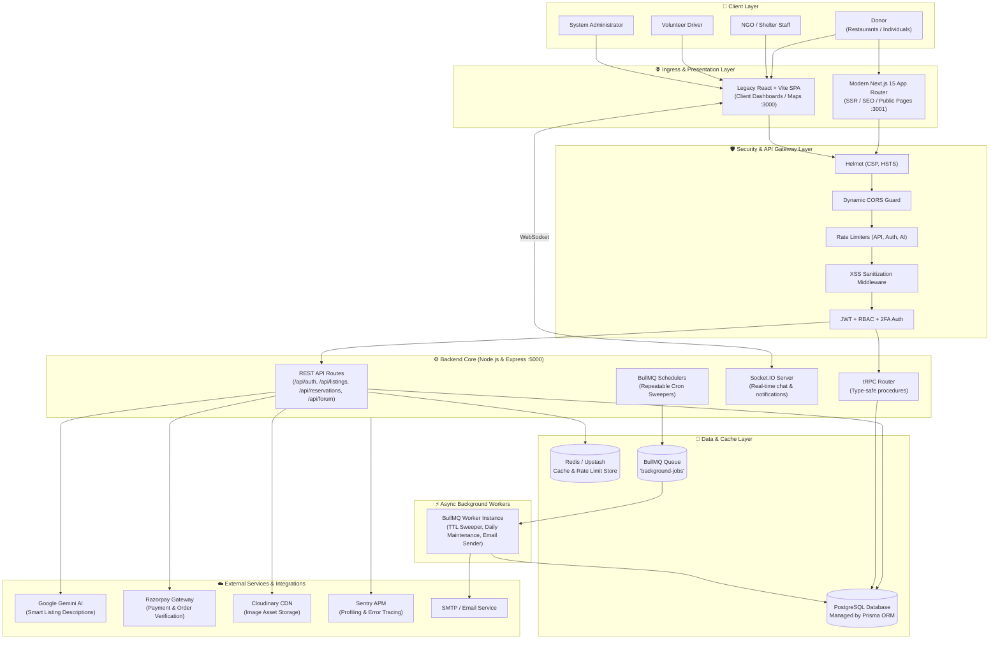
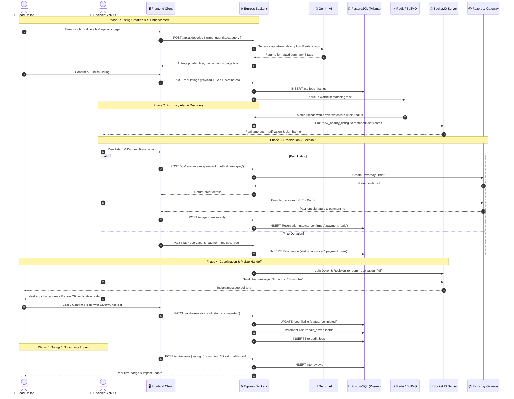
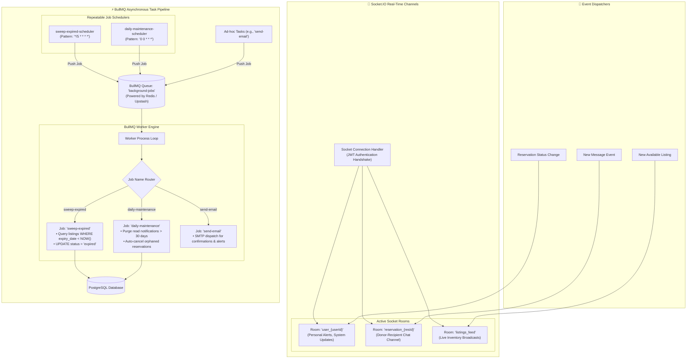
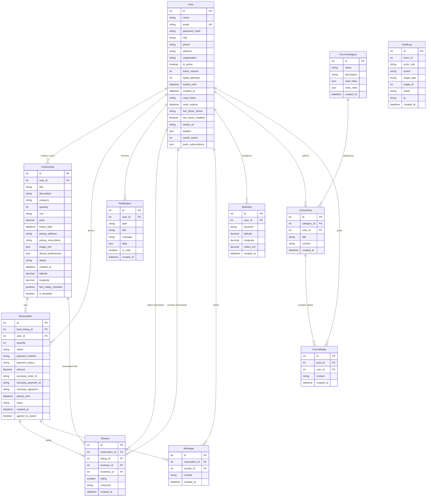

# 🏛️ Left2Serve System Architecture & Technical Design

This document details the software architecture, system components, data models, communication flows, and deployment topologies of the **Left2Serve** platform.

---

## 📑 Table of Contents
1. [High-Level System & Component Architecture](#1-high-level-system--component-architecture)
2. [Dual-Frontend & Migration Architecture (Strangler Fig Pattern)](#2-dual-frontend--migration-architecture-strangler-fig-pattern)
3. [End-to-End Donation & Claiming Workflow](#3-end-to-end-donation--claiming-workflow)
4. [Real-Time Messaging & Background Worker Subsystem](#4-real-time-messaging--background-worker-subsystem)
5. [Database Entity-Relationship Diagram (ERD)](#5-database-entity-relationship-diagram-erd)

---

## 1. High-Level System & Component Architecture

Left2Serve is structured as a cloud-native, decoupled platform featuring dual client frontends, an Express + tRPC API backend, relational and in-memory databases, asynchronous background workers, and third-party integrations.

---

## 2. Dual-Frontend & Migration Architecture (Strangler Fig Pattern)

Left2Serve uses the **Strangler Fig Pattern** to migrate incrementally from a legacy Vite single-page application (SPA) to a modern Next.js 15 Server-Side Rendered (SSR) architecture without operational downtime.

```mermaid
flowchart LR
    User([🌐 Incoming Web Traffic]) --> Router{{"Reverse Proxy / Edge Ingress"}}

    subgraph NextSSR["⚡ Modern Frontend (Next.js 15 App Router - Port 3001)"]
        Landing["/ (Home & Discovery)"]
        FoodFeed["/listings (Public Feed & SSR SEO)"]
        DonorPortal["/donor/create (AI-assisted listing form)"]
        About["/about & /impact (Static/Dynamic Stats)"]
        RSC["React Server Components (RSC)"]
        ClientNext["Client Islands & Hydration"]
    end

    subgraph ViteLegacy["📦 Legacy Frontend (Vite + React Router - Port 3000)"]
        MapDash["/dashboard/map (Leaflet Clustering)"]
        ChatRealtime["/chat/:reservationId (Socket.IO)"]
        QRScanner["/verify-pickup (HTML5 QR Scanner)"]
        AdminConsole["/admin/* (Role Management & Audit)"]
        ForumBoard["/community/forum"]
    end

    Router -->|"Public / SEO / SSR Routes"| NextSSR
    Router -->|"Complex Interactive / Map / Admin"| ViteLegacy

    subgraph SharedLayer["🔗 Shared Application State & Services"]
        Zustand["Zustand Client Store (Auth Token & User Profile)"]
        TanStack["TanStack Query (Cache Invalidation)"]
        TRPCClient["@trpc/client (Shared Type Definitions)"]
    end

    NextSSR -.-> SharedLayer
    ViteLegacy -.-> SharedLayer

    subgraph BackendAPI["🚀 Left2Serve API Backend (:5000)"]
        API["REST & tRPC Endpoints"]
    end

    SharedLayer --> BackendAPI
```

---

## 3. End-to-End Donation & Claiming Workflow

This sequence diagram illustrates the lifecycle of a food listing—from AI-enhanced listing creation by a donor, geospatial matching with watchlists, reservation claiming with Razorpay payment, real-time messaging, to physical QR handoff and impact audit.

---

## 4. Real-Time Messaging & Background Worker Subsystem

Left2Serve combines WebSocket connection rooms via Socket.IO with BullMQ Redis-backed queues for scheduled and asynchronous workloads.

---

## 5. Database Entity-Relationship Diagram (ERD)

This entity-relationship diagram shows the relational schema modeled in PostgreSQL via Prisma ORM, highlighting primary keys, foreign keys, and relational cardinality.

